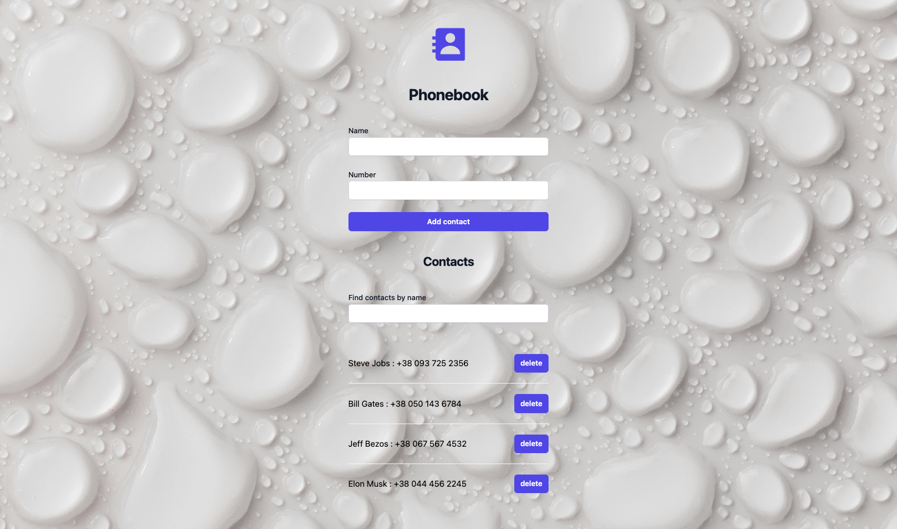

# Критерії приймання

- При здачі домашньої роботи є посилання: на вихідні файли та робочу сторінку
  проекту на `GitHub Pages`.
- Під час запуску коду завдання в консолі відсутні помилки та попередження.
- Для кожного компонента є окрема папка з файлом React-компонента та файлом
  стилів
- Імена компонентів зрозумілі та описові.

## Книга контактів

- Створений репозиторій `goit-react-woolf-hw-06-phonebook`.

Виконай рефакторинг коду застосунку «Книга контактів», додавши управління станом
за допомогою бібліотеки [Redux Toolkit](https://redux-toolkit.js.org/).

Нехай Redux-стан виглядає наступним чином.

```bash
{
  contacts: [],
  filter: ""
}
```

- Створи сховище з `configureStore()`
- Використовуй функцію `createSlice()`
- Створи дії збереження та видалення контакту, а також оновлення фільтра
- Зв'яжи React-компоненти з Redux-логікою за допомогою хуків бібліотеки
  [react-redux](https://react-redux.js.org/).
- Використай бібліотеку Redux Persist для збереження масиву контактів у
  локальному сховищі

### Фінальний результат


